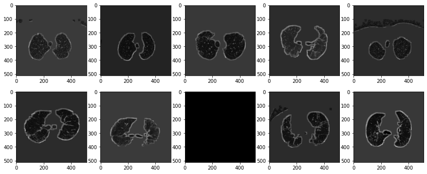
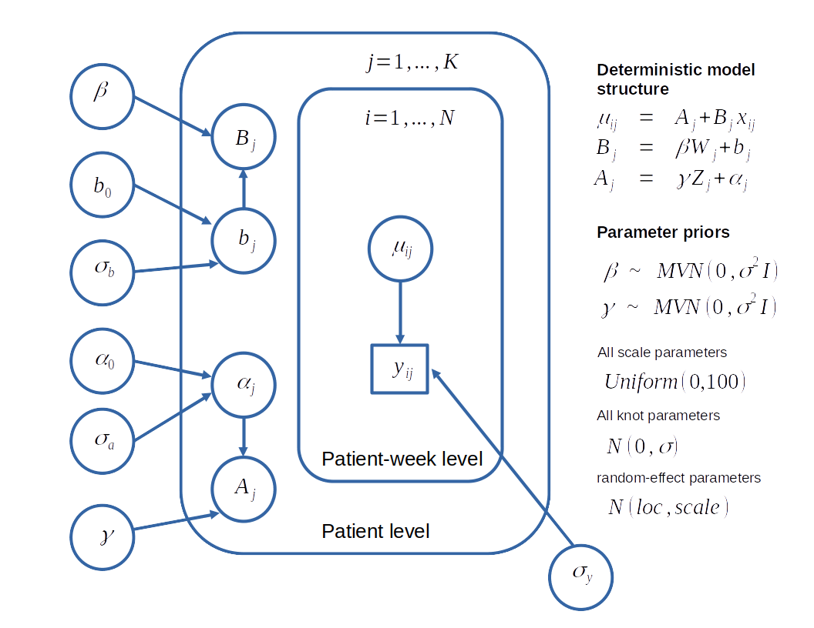

# OSIC pulmonary fibrosis competition (Bayesian Modeling) 

## Introduction
The OSIC pulmonary fibrosis progression competition is a Kaggle competition wherein 
you are given the task of predicting FVC (Forced Vital Capacity) which is related to 
the total amount of air exhaled during a Forced Expiratory Volume (FEV) test for the next 146 weeks.
You are given CT scan images for the first encounter, metadata, and information for the past weeks.

Shown below is the loss function that was used to evaluate results in the competition:

 

## Approach

### CT scan processing
We determine a mask to differentiate the lungs with the other entities in the image. I did this
with two methods :1) simple pixel threshold differentiation and 2) KMeans clustering. 
Further image processing like erosion and dilation were applied to further differentiate the two areas.
The identified mask was then applied to the original image to get the isolated lung image. 

A result of these operations are shown below:

After isolating the lung, pixel statistics were determined from the resulting image to be used as features 
in the succeeding models. Statistics such as the mean, variance, skew, and kurtosis were determined.

### Bayesian Modeling

Markov Chain Monte Carlo (MCMC) sampling methods and variational inference were used
to estimate the parameters for the model. The generative model was hierarchical, which means that 
information is dependent over different levels from the *overall* -> *patient* -> *patient-week* level.  

More precisely, the general generative model structure can be expressed with this graph:

## Results

The highest scoring model garnered me a rank of 1,213 out of 2,007, which is among
the top 58%.

|Model |Private score|Public score| 
|------|------|------|
|Variational inference |-7.9496 | -8.5531 |
|Intercept-only Hierarchical model (MCMC)| -9.5848 | -9.6258 |
|Model with covariates HM (MCMC)| -6.9190 | -9.6258 |

  
